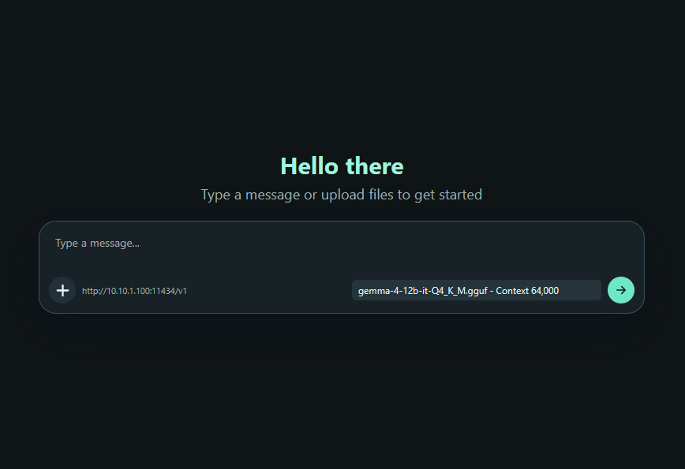

# TinyChat

Extremely lightweight Go web chat UI for OpenAI-compatible chat APIs, intended to feel close to the built-in `llama.cpp` web UI while staying tiny and dependency-free.

TinyChat was inspired by the built-in web UI from [`llama.cpp`](https://github.com/ggml-org/llama.cpp).



## Host TinyChat

### Native

Run the binary directly and configure the OpenAI-compatible endpoint through the host environment:

```sh
OPENAI_CHAT_HOST=https://api.example.com/v1 APP_HOST=0.0.0.0 APP_PORT=8080 tinychat
```

Open `http://your-server:8080`.

### Docker

Run the container and configure the OpenAI-compatible endpoint through the container environment:

```sh
docker run --rm -p 8080:8080 -e APP_HOST=0.0.0.0 -e OPENAI_CHAT_HOST=https://api.example.com/v1 tinychat
```

Open `http://your-server:8080`.

### Docker Compose

```sh
OPENAI_CHAT_HOST=https://api.example.com/v1 docker compose up -d --build
```

Open `http://your-server:8080`.

Temporary browser-provided endpoints are intended only for local testing. For production or shared deployments, set `OPENAI_CHAT_HOST` on the host server.

## Build With Docker

```sh
docker build -t tinychat .
```

## Environment Variables

| Variable           | Default     | Description                                                                                                                                                                                    |
| ------------------ | ----------- | ---------------------------------------------------------------------------------------------------------------------------------------------------------------------------------------------- |
| `APP_PORT`         | `8080`      | HTTP port for the web UI.                                                                                                                                                                      |
| `APP_HOST`         | `127.0.0.1` | Bind host for standalone runs. Docker sets this to `0.0.0.0`.                                                                                                                                  |
| `OPENAI_CHAT_HOST` | empty       | OpenAI-compatible API base URL. `http://` is added when the scheme is omitted; use `https://...` for HTTPS endpoints. If empty, the UI can accept a temporary endpoint for local testing only. |

## License

MIT. See [LICENSE](LICENSE).
